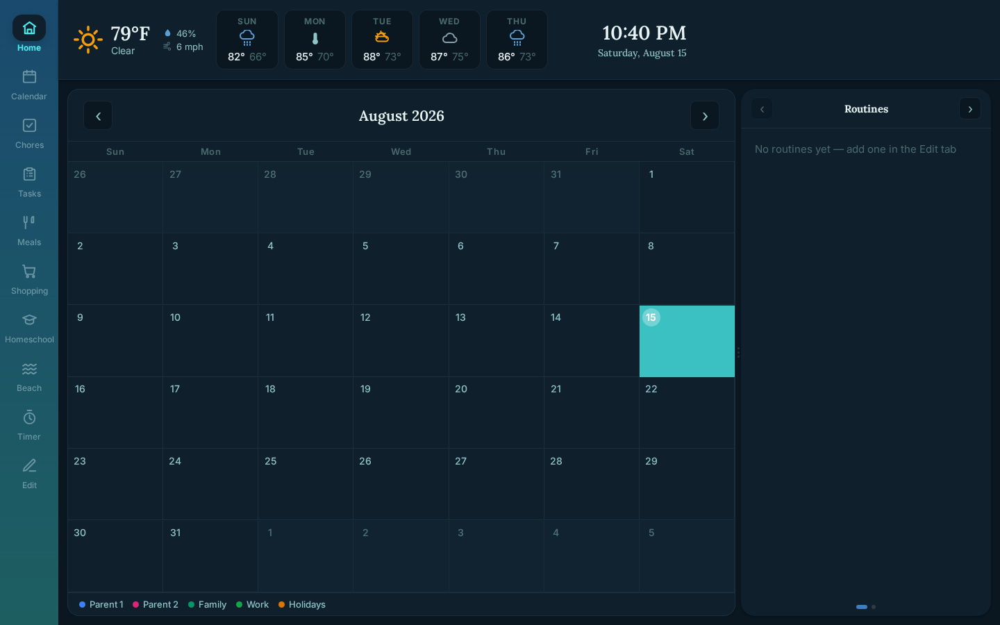
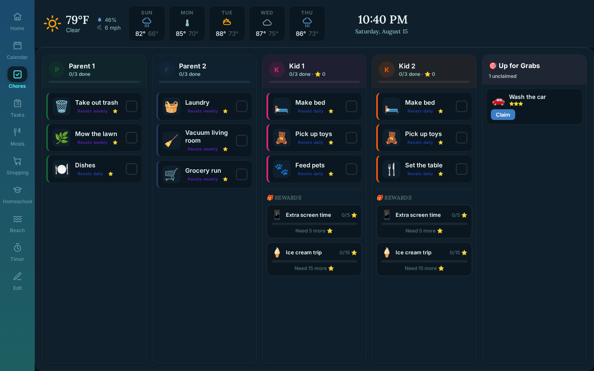
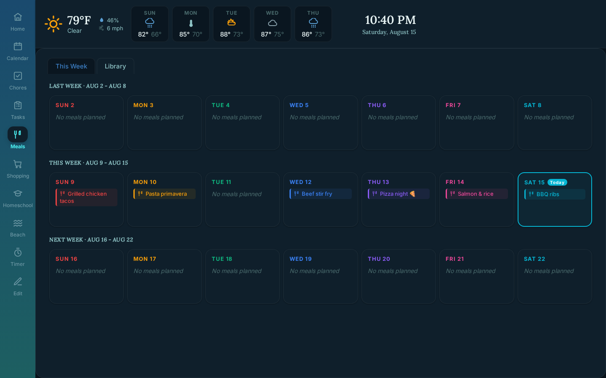
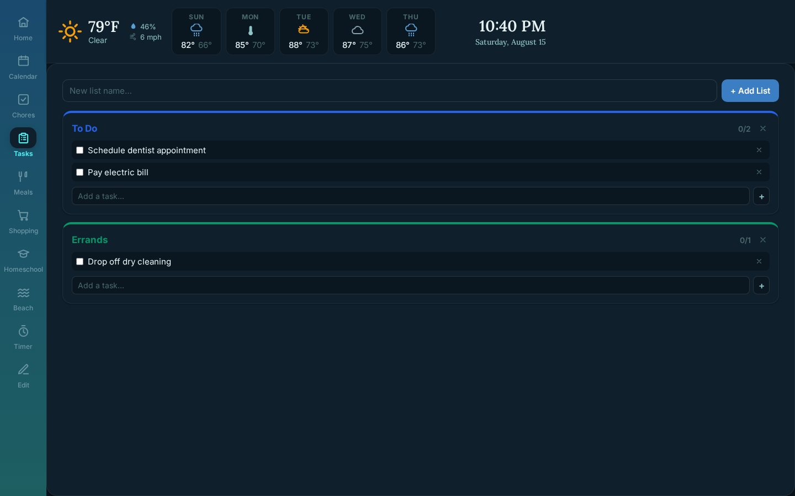
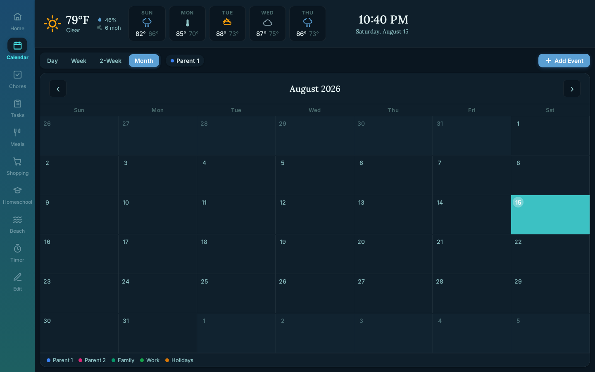
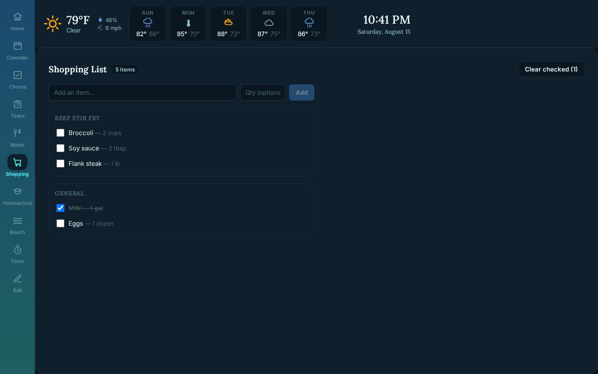

# Family Dashboard

A self-hosted family calendar, chores, meals, and tasks dashboard — built as a PWA for a wall-mounted tablet, but works fine in any browser.

Everything runs in two small Docker containers (React frontend + Express backend) with a JSON-file "database" on disk. No cloud account, subscription, or database server required — bring your own calendar and, optionally, a couple of free API keys.

## Features

- **Calendar** — CalDAV sync (e.g. Google via app password) and/or Google OAuth, multiple accounts, with automatic dedupe between the two
- **Chores** — per-person chore lists with a star-reward system, "up for grabs" shared chores, and configurable reward goals
- **Meals** — weekly meal planner, recipe search (Spoonacular) with a self-hosted [Mealie](https://mealie.io/) fallback, recipe URL scraping, a saved meal library with ratings
- **Shopping list** — generated from planned meals' ingredients
- **Tasks & routines** — multiple task lists, daily routines with steps, morning/evening checklists
- **Homeschool planner** — per-kid, per-day activity schedules with themed days
- **Workouts** — exercise library and per-person workout logging
- **Extras** — weather, NOAA tide/beach conditions, countdown timers, recurring reminders, and a photo screensaver for idle time

## Screenshots

| | |
|---|---|
| **Home** — weather, month calendar, routines | **Chores** — star rewards and up-for-grabs |
|  |  |
| **Meals** — weekly planner | **Tasks** — multiple lists |
|  |  |
| **Calendar** — day/week/2-week/month views | **Shopping** — grouped by source meal |
|  |  |

_Shown with a fresh install's default placeholder data — no calendars connected, so the calendar view is empty in these shots._

## Tech stack

| Layer    | Stack |
|----------|-------|
| Frontend | React 18, Vite, `vite-plugin-pwa` — no CSS framework, plain inline styles |
| Backend  | Node.js, Express, flat JSON files on disk (no database) |
| Sync     | CalDAV (raw REPORT requests), Google Calendar API (OAuth2), NOAA CO-OPS, Open-Meteo, Spoonacular, Mealie |
| Deploy   | Docker Compose, two containers (`frontend` on nginx, `backend` on Node) |

## Setup

### 1. Configure your environment

```bash
cp .env.example .env
```

Edit `.env` and fill in whatever's relevant to you — everything is optional except `TZ`. Leaving a section blank just disables that integration (e.g. no `CALDAV_*` means no CalDAV calendar; no `SPOONACULAR_API_KEY` means recipe search falls back to Mealie or is skipped).

| Variable | Required | Purpose |
|----------|----------|---------|
| `TZ` | Recommended | Timezone for chore/routine resets and "today" logic |
| `CALDAV_URL` / `CALDAV_USERNAME` / `CALDAV_PASSWORD` | No | CalDAV calendar sync — for Google, use an [app password](https://myaccount.google.com/apppasswords) |
| `WEATHER_LAT` / `WEATHER_LON` / `WEATHER_LOCATION_LABEL` | No | Location for the weather widget (defaults to NYC coordinates with no label shown) |
| `GOOGLE_CLIENT_ID` / `GOOGLE_CLIENT_SECRET` / `GOOGLE_REDIRECT_URI` | No | Google OAuth calendar sync — create credentials in the [Google Cloud Console](https://console.cloud.google.com/apis/credentials) |
| `DASHBOARD_URL` | No | Public URL to redirect to after Google OAuth completes |
| `SPOONACULAR_API_KEY` | No | Recipe search — free key from [spoonacular.com/food-api](https://spoonacular.com/food-api) |
| `TIDE_BEACHES` | No | JSON array of `{ id, name, station }` — find NOAA station IDs at [tidesandcurrents.noaa.gov/map](https://tidesandcurrents.noaa.gov/map/) |
| `MEALIE_URL` / `MEALIE_API_TOKEN` | No | Fallback recipe source — a self-hosted [Mealie](https://mealie.io/) instance (can also be set per-install from the UI's Connected Accounts screen) |

### 2. Deploy

```bash
docker compose up -d --build
```

Or via Portainer: Stacks → Add Stack → paste `docker-compose.yml`, then add the same variables under the stack's environment section (or upload `.env` alongside it).

### 3. Access

- `http://<server-ip>:3000`
- Install as a PWA: open in Chrome on a tablet → browser menu → "Add to Home Screen"

## Adding more calendars

Beyond the one configured via `CALDAV_*`, add more from the UI (Edit tab → Connected Accounts) or directly:

```bash
curl -X POST http://<server>:3001/api/calendars \
  -H 'Content-Type: application/json' \
  -d '{
    "id": "partner",
    "name": "Partner",
    "color": "#7c3aed",
    "url": "https://www.google.com/calendar/dav/partner@gmail.com/events",
    "username": "partner@gmail.com",
    "password": "app_password_here"
  }'
```

## Customizing tabs

The sidebar's tab list lives in `frontend/src/components/Sidebar.jsx` (the `TABS` array) with each tab's content wired up in `frontend/src/App.jsx`. A few tabs worth knowing about:

**Workouts** — the `Workouts.jsx` component exists in the repo but isn't wired into the sidebar by default. To turn it on:

1. In `frontend/src/components/Sidebar.jsx`, add an entry to `TABS` (anywhere in the array — order here is display order):
   ```js
   { id: 'workouts', icon: 'dumbbell', label: 'Workouts' },
   ```
2. In `frontend/src/App.jsx`, import the component near the other tab imports:
   ```js
   import Workouts from './components/Workouts';
   ```
3. Then add a render block alongside the other `{tab === '...' && (...)}` blocks (e.g. right after the `timer` block):
   ```jsx
   {tab === 'workouts' && (
     <div style={{ ...s.paneLayout, ...(isMobile ? s.paneLayoutMobile : {}) }}>
       <Workouts />
     </div>
   )}
   ```
4. Rebuild the frontend (`docker compose up -d --build frontend`, or `npm run dev` locally).

The `dumbbell` icon is already defined in `Icon.jsx`, and the backend's `/api/exercise-library` and `/api/workouts` routes are always active — no backend changes needed.

**Beach / tides** — on by default, backed by NOAA tide predictions (see `TIDE_BEACHES` in `.env.example`). If it's not useful to you, remove it:

1. In `frontend/src/components/Sidebar.jsx`, delete the `{ id: 'beach', ... }` line from `TABS`.
2. In `frontend/src/App.jsx`, remove the `import Beach from './components/Beach';` line and the `{tab === 'beach' && (...)}` render block.
3. Rebuild the frontend.

Leaving the backend's `/api/tides` route in place is harmless (it just won't be called), so no backend changes are required either way.

**Homeschool** — also on by default. If you don't need it, remove it the same way:

1. In `frontend/src/components/Sidebar.jsx`, delete the `{ id: 'homeschool', ... }` line from `TABS`.
2. In `frontend/src/App.jsx`, remove the `import Homeschool from './components/Homeschool';` line and the `{tab === 'homeschool' && (...)}` render block.
3. Rebuild the frontend.

As with tides, the backend's `/api/homeschool*` routes and `data/homeschool.json` are harmless to leave in place unused.

## Project structure

```
backend/
  server.js          Express app — all API routes, CalDAV/Google/weather/tide fetchers, JSON persistence
frontend/
  src/
    App.jsx           Tab navigation shell
    components/       One component per dashboard tab/widget
    hooks/            Screen-size and day/night detection
    utils/            Date helpers
data/                 Runtime JSON "database" — created on first run, git-ignored
```

## Data & privacy

All state lives in `./data/*.json` on the host, created automatically on first run with generic placeholder content (people named "Parent 1/2", "Kid 1/2", a sample chore list, etc.) — customize it through the UI. This folder, along with `.env`, is git-ignored: it's where any calendar passwords, OAuth tokens, and Mealie API tokens end up once you configure them, and none of that belongs in version control.

## Ports

| Service  | Port |
|----------|------|
| Frontend | 3000 |
| Backend  | 3001 |

## License

[MIT](LICENSE)
